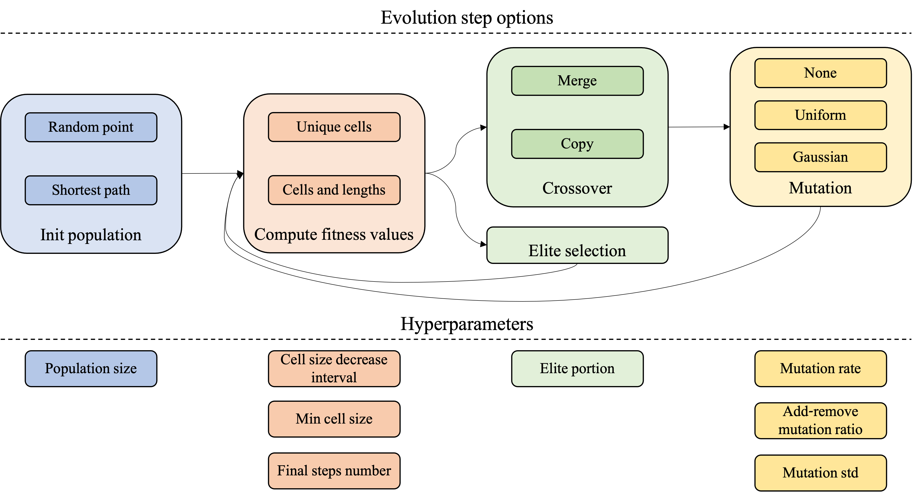

# cleaner-robot-ga
A solver for the Coverage Path Planning (CPP) problem that uses a genetic algorithm approach.
The rationale for this implementation is detailed in [this paper](paper.pdf).
Supports multiple robots scenarios.
This solver uses the  [DiscoPygal](https://www.cs.tau.ac.il/~cgl/discopygal/docs/index.html)
 framework.


## Example Usage
### Requirements
To install the requirements, run:
```bash
pip install -r requirements.txt
```
### Running the script

#### TLDR
`main.py` is the script to run.


To run the script, run (a specific example with real values below):
```bash
python main.py --parameter_to_check [...] --parameter_values [...] [MORE_OPTIONS]
```

#### Evaluation parameters
The argument `--parameter_to_check` is used to specify a hyperparameter for the genetic
 algorithm, to compare the solver's output for different values of this paramter. The values
 to check should be passed to the argument `--parameter_values`.

#### Scenes


This script runs a the solver on either:
* A specific scene from `scenes` directory, if the argument `--scene_filename` is passed together
with a specific scene filename.
* All scenes from `scenes` directory otherwise.


#### Outputs
The output of the script is in a directory under `out` directory, which contains some output examples. The name of the output directory
can be passed using the `--out_dir` argument, and if it is not provided then the name of the directory
is the start time of the experiment.
The output files are:
* A json file with the hyperparameters that were used in the experiment.
* A graph that shows the fitness values as a function of the steps for the different
values which were passed by `--parameter_values` argument.
* Statistics about the running time in a csv file.


#### Changing other hyperparameters
The script supports changing different hyperparameters of the genetic algorithm. To see the available
 options, run: 

```
python main.py --help
```

#### Example usage

Running an experiment for all scenes.
```bash
python main.py --parameter_to_check population_size --parameter_values 10 20 --mutation_rate 0.4 --evolution_steps 30 --out_dir example1
```

Running an experiment for a specific scene.

```bash
python main.py --scene_filename scene3.json --parameter_to_check population_size --parameter_values 10 20  --mutation_rate 0.4 --evolution_steps 30  --out_dir example2
```

#### Using GUI
Running the following command in the terminal opens a GUI in which a scene and the solver can
be loaded, for results visualizations.
```bash
solver_viewer
```


## Acknowledgements
This project was made possible by the [DiscoPygal](https://www.cs.tau.ac.il/~cgl/discopygal/docs/index.html) suite of 
tools.
